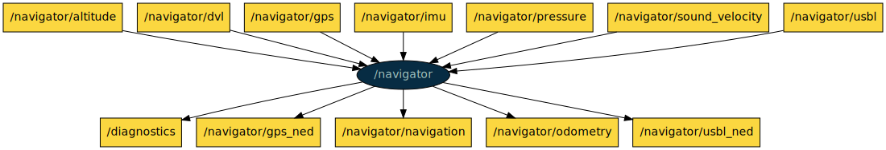
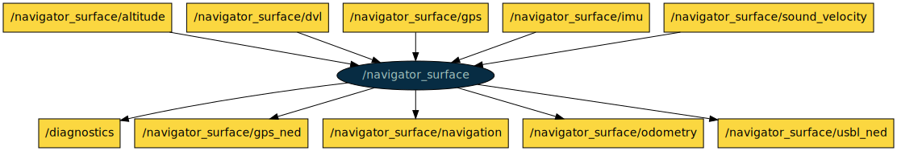

# COLA2 NAV

This is a ROS package with nodes to estimate the position of the AUV.

[TOC]

[//]: <> (navigator start)

## navigator

**Node**: /navigator

This node merges data from different navigation sensors of an AUV to estimate the robot position and velocity using an Extended Kalman Filter.

**Publishers**:

* /diagnostics [[diagnostic_msgs/DiagnosticArray](http://docs.ros.org/melodic/api/diagnostic_msgs/html/msg/DiagnosticArray.html)]
* /navigator/gps_ned [[geometry_msgs/PoseStamped](http://docs.ros.org/melodic/api/geometry_msgs/html/msg/PoseStamped.html)]
* /navigator/navigation [[cola2_msgs/NavSts](http://api.iquarobotics.com/202010/api/cola2_msgs/html/msg/NavSts.html)]
* /navigator/odometry [[nav_msgs/Odometry](http://docs.ros.org/melodic/api/nav_msgs/html/msg/Odometry.html)]
* /navigator/usbl_ned [[geometry_msgs/PoseStamped](http://docs.ros.org/melodic/api/geometry_msgs/html/msg/PoseStamped.html)]

**Subscribers**:

* /navigator/altitude [[sensor_msgs/Range](http://docs.ros.org/melodic/api/sensor_msgs/html/msg/Range.html)]
* /navigator/dvl [[cola2_msgs/DVL](http://api.iquarobotics.com/202010/api/cola2_msgs/html/msg/DVL.html)]
* /navigator/gps [[sensor_msgs/NavSatFix](http://docs.ros.org/melodic/api/sensor_msgs/html/msg/NavSatFix.html)]
* /navigator/imu [[sensor_msgs/Imu](http://docs.ros.org/melodic/api/sensor_msgs/html/msg/Imu.html)]
* /navigator/pressure [[sensor_msgs/FluidPressure](http://docs.ros.org/melodic/api/sensor_msgs/html/msg/FluidPressure.html)]
* /navigator/sound_velocity [[cola2_msgs/Float32Stamped](http://api.iquarobotics.com/202010/api/cola2_msgs/html/msg/Float32Stamped.html)]
* /navigator/usbl [[geometry_msgs/PoseWithCovarianceStamped](http://docs.ros.org/melodic/api/geometry_msgs/html/msg/PoseWithCovarianceStamped.html)]

**Services**:

* /navigator/reload_ned [[std_srvs/Trigger](http://docs.ros.org/melodic/api/std_srvs/html/srv/Trigger.html)]
* /navigator/reload_params [[std_srvs/Trigger](http://docs.ros.org/melodic/api/std_srvs/html/srv/Trigger.html)]
* /navigator/reset_navigation [[std_srvs/Trigger](http://docs.ros.org/melodic/api/std_srvs/html/srv/Trigger.html)]
* /navigator/set_depth_sensor_offset [[std_srvs/Trigger](http://docs.ros.org/melodic/api/std_srvs/html/srv/Trigger.html)]

**Parameters**:

* /navigator/declination_in_degrees
* /navigator/depth_sensor_offset
* /navigator/dvl_fallback_delay
* /navigator/dvl_max_v
* /navigator/enable_debug
* /navigator/gps_samples_to_init
* /navigator/initial_state_covariance
* /navigator/initialize_depth_sensor_offset
* /navigator/initialize_filter_from_gps
* /navigator/min_diagnostics_frequency
* /navigator/ned_latitude
* /navigator/ned_longitude
* /navigator/prediction_model_covariance
* /navigator/surface_to_depth_sensor_distance
* /navigator/use_depth_data
* /navigator/use_dvl_data
* /navigator/use_gps_data
* /navigator/use_usbl_data
* /navigator/water_density

[//]: <> (navigator end)

[//]: <> (navigator_surface start)

## navigator_surface

**Node**: /navigator_surface

This node merges data from different navigation sensors of an ASV to estimate the robot position and velocity using an Extended Kalman Filter.

**Publishers**:

* /diagnostics [[diagnostic_msgs/DiagnosticArray](http://docs.ros.org/melodic/api/diagnostic_msgs/html/msg/DiagnosticArray.html)]
* /navigator_surface/gps_ned [[geometry_msgs/PoseStamped](http://docs.ros.org/melodic/api/geometry_msgs/html/msg/PoseStamped.html)]
* /navigator_surface/navigation [[cola2_msgs/NavSts](http://api.iquarobotics.com/202010/api/cola2_msgs/html/msg/NavSts.html)]
* /navigator_surface/odometry [[nav_msgs/Odometry](http://docs.ros.org/melodic/api/nav_msgs/html/msg/Odometry.html)]
* /navigator_surface/usbl_ned [[geometry_msgs/PoseStamped](http://docs.ros.org/melodic/api/geometry_msgs/html/msg/PoseStamped.html)]

**Subscribers**:

* /navigator_surface/altitude [[sensor_msgs/Range](http://docs.ros.org/melodic/api/sensor_msgs/html/msg/Range.html)]
* /navigator_surface/dvl [[cola2_msgs/DVL](http://api.iquarobotics.com/202010/api/cola2_msgs/html/msg/DVL.html)]
* /navigator_surface/gps [[sensor_msgs/NavSatFix](http://docs.ros.org/melodic/api/sensor_msgs/html/msg/NavSatFix.html)]
* /navigator_surface/imu [[sensor_msgs/Imu](http://docs.ros.org/melodic/api/sensor_msgs/html/msg/Imu.html)]
* /navigator_surface/sound_velocity [[cola2_msgs/Float32Stamped](http://api.iquarobotics.com/202010/api/cola2_msgs/html/msg/Float32Stamped.html)]

**Services**:

* /navigator_surface/reload_ned [[std_srvs/Trigger](http://docs.ros.org/melodic/api/std_srvs/html/srv/Trigger.html)]
* /navigator_surface/reload_params [[std_srvs/Trigger](http://docs.ros.org/melodic/api/std_srvs/html/srv/Trigger.html)]
* /navigator_surface/reset_navigation [[std_srvs/Trigger](http://docs.ros.org/melodic/api/std_srvs/html/srv/Trigger.html)]
* /navigator_surface/set_depth_sensor_offset [[std_srvs/Trigger](http://docs.ros.org/melodic/api/std_srvs/html/srv/Trigger.html)]

**Parameters**:

* /navigator_surface/declination_in_degrees
* /navigator_surface/depth_sensor_offset
* /navigator_surface/dvl_fallback_delay
* /navigator_surface/dvl_max_v
* /navigator_surface/enable_debug
* /navigator_surface/gps_samples_to_init
* /navigator_surface/initial_state_covariance
* /navigator_surface/initialize_depth_sensor_offset
* /navigator_surface/initialize_filter_from_gps
* /navigator_surface/min_diagnostics_frequency
* /navigator_surface/ned_latitude
* /navigator_surface/ned_longitude
* /navigator_surface/prediction_model_covariance
* /navigator_surface/surface_to_depth_sensor_distance
* /navigator_surface/use_depth_data
* /navigator_surface/use_dvl_data
* /navigator_surface/use_gps_data
* /navigator_surface/use_usbl_data
* /navigator_surface/water_density

[//]: <> (navigator_surface end)
